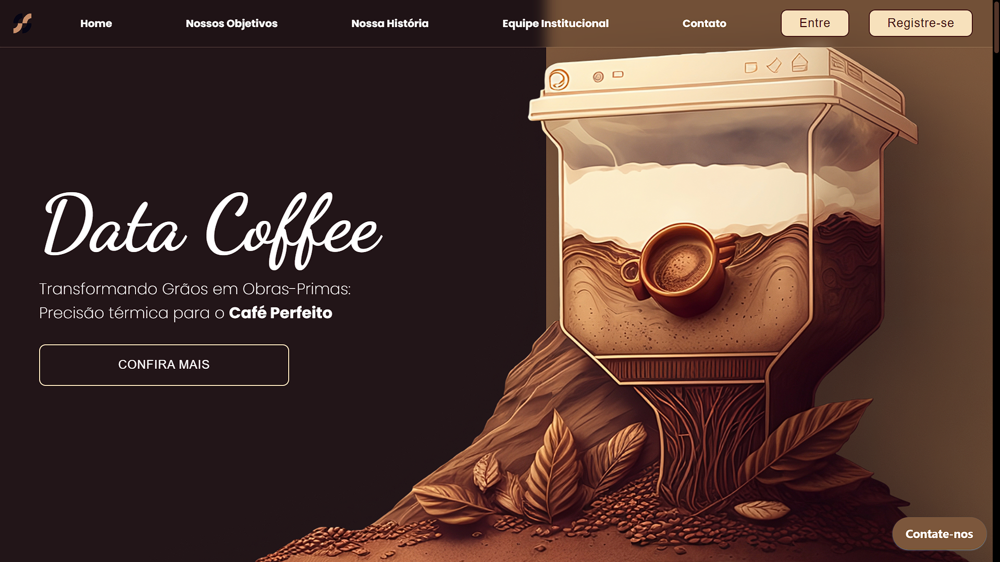
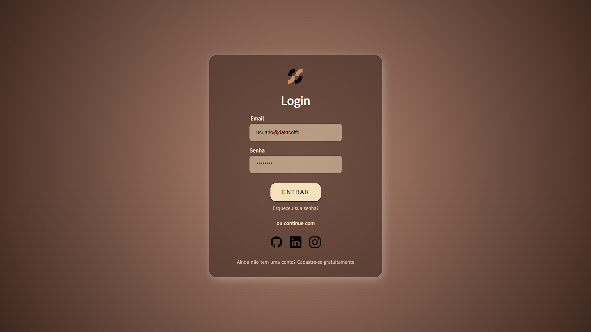
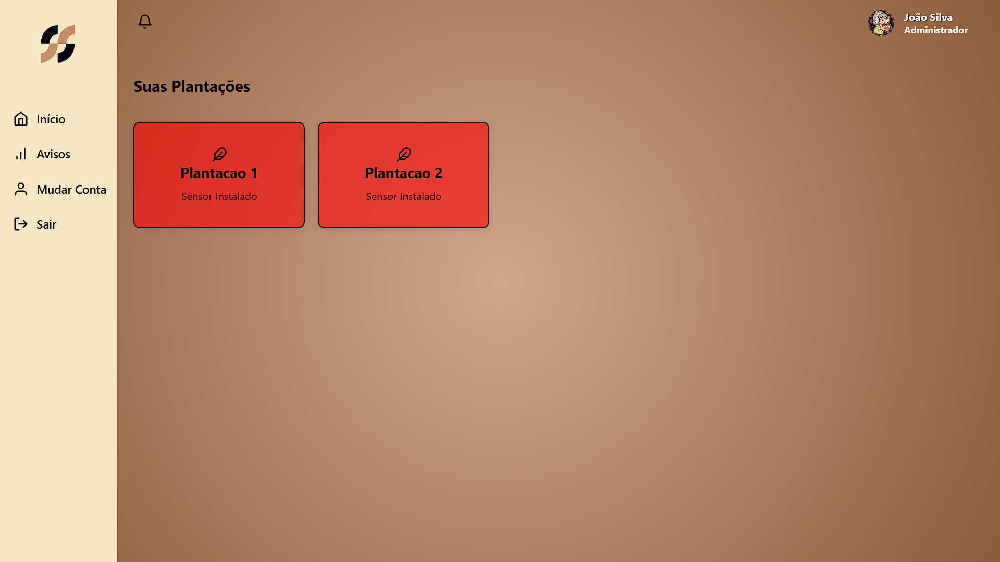
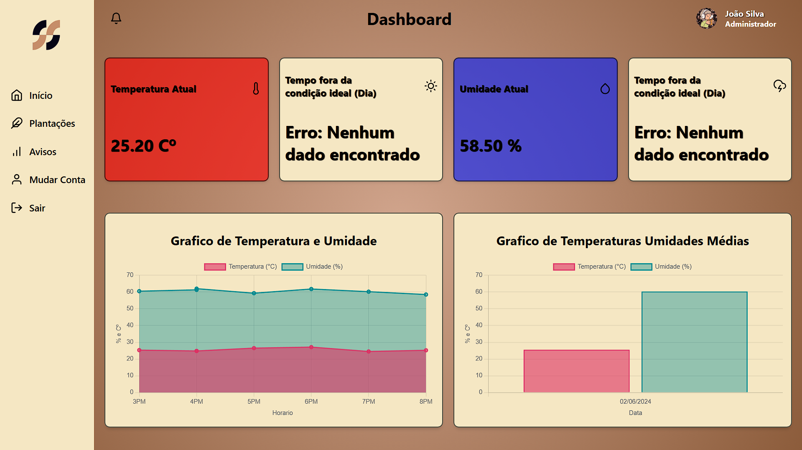
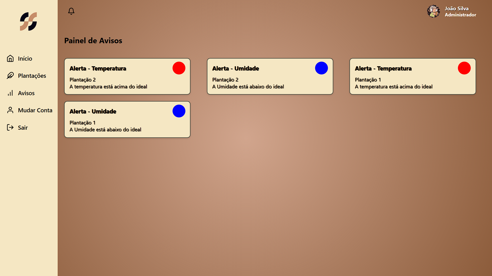

# 🪴 Gestão de Temperatura e Umidade do Solo na Produção de Café Gourmet

## 🛠️ Introdução

Este projeto consiste em um sistema de monitoramento de temperatura e umidade do solo, desenvolvido para otimizar a produção de café gourmet. Com sensores integrados, os agricultores podem acompanhar as condições do cultivo em tempo real. Além disso, criamos uma dashboard intuitiva que facilita a visualização dos dados e auxilia na tomada de decisões, garantindo a qualidade dos grãos e maior eficiência produtiva.

> Imagem da Página Principal 

> Imagem da Página Login

> Imagem da Página Plantações

> Imagem da Página Dashboard

> Imagem da Página Avisos

---

## 📚 Objetivos

- **Monitoramento em Tempo Real:** Fornecer dados precisos e atualizados de umidade e temperatura do solo, permitindo aos agricultores acompanhar as condições do cultivo de forma contínua e eficiente.  
- **Otimização da Irrigação:** Analisar as informações coletadas para identificar o momento ideal e a quantidade exata de irrigação, promovendo o uso sustentável da água e maximização da produtividade.  
- **Adaptação às Mudanças Climáticas:** Auxiliar os produtores a lidar com os impactos das alterações climáticas, oferecendo dados detalhados para ajustar estratégias de cultivo de forma proativa.  
- **Produção Sustentável de Café Gourmet:** Garantir uma produção mais eficiente e ecológica, reduzindo perdas, otimizando custos e aprimorando a qualidade dos grãos para atender aos padrões do mercado gourmet.  

---

## 💻 Tecnologias Utilizadas

- 
- 
- 
- 
- 
- 
- 
- 
- 

---

## 🤝 Contribuidores

- [Ali Kadri](https://github.com/AliKadri2)
- [Carlos Eduardo](https://github.com/KaduRibeiro1)
- [Felipe Lima](https://github.com/felipe-lim4)
- [Harison Rios](https://github.com/HarisonRios)
- [João Victor](https://github.com/JoaoGaldinoCunha)
- [Rodrigo Olivares](https://github.com/Olivaresss)

---

## 📝 Licença

Este projeto está sob licença. Veja o arquivo [LICENSE](LICENSE.md) para mais detalhes.
